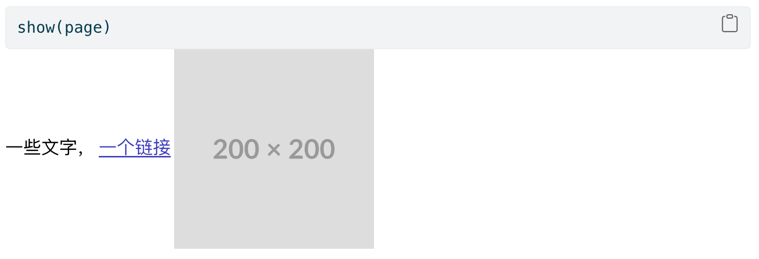

# FastHTML示例
从头开始介绍 FastHTML，包含四个完整的示例

构建 Web 应用程序涉及许多非 FastHTML 特定的技巧和模式。本教程的主要目标是提供 FastHTML 的另一种介绍。构建示例应用程序以展示常用的模式。此外，说明一些可以在 FastHTML 基础上构建以创建您自己的自定义 Web 应用程序的方法。次要目标是使它成为一份有用的文档，添加到 LLM 上下文中，将其变成有用的 FastHTML 助手。

让我们开始吧。

## FastHTML基础
FastHTML 就是Python。你可以通过 `pip install python-fasthtml` 安装它。
为其构建的扩展/组件同样可以通过 PyPI 或作为简单的 Python 文件分发。

FastHTML 的核心用法是定义路由，然后定义在每个路由上执行的操作。这类似于[FastAPI](https://fastapi.tiangolo.com/) Web 框架（事实上，我们实现了许多功能以匹配 FastAPI 使用示例），但 FastAPI 专注于返回 JSON 数据来构建 API，而 FastHTML 专注于返回 HTML 数据。

这是一个返回“Hello, World”消息的简单 FastHTML 应用程序：
```python
from fasthtml import FastHTML

app = FastHTML()

@app.get("/")
def home():
    return "<h1>Hello, World</h1>"
```

要运行此应用程序，请将其放在一个文件中，例如 `app.py` ，然后使用运行它 `uvicorn app:app --reload` 。您将看到如下消息：

```
INFO:     Will watch for changes in these directories: ['/home/jonathan/fasthtml-example']
INFO:     Uvicorn running on http://127.0.0.1:8000 (Press CTRL+C to quit)
INFO:     Started reloader process [871942] using WatchFiles
INFO:     Started server process [871945]
INFO:     Waiting for application startup.
INFO:     Application startup complete.
```

如果您在浏览器中导航到 `[http://127.0.0.1:8000](http://127.0.0.1:8000) ，您将看到“Hello, World”。如果您编辑文件 `app.py` 并保存，服务器将重新加载，当您在浏览器中刷新页面时，您将看到更新的消息。

## 构建HTML
请注意，我们在上一个示例中编写了一些 HTML。我们不想这样做！一些 Web 框架要求您学习 HTML、CSS、JavaScript 和一些模板语言以及 Python。我们希望只用一种语言做尽可能多的事情。幸运的是，Python 模块 [fastcore.xml](https://fastcore.fast.ai/xml.html) 拥有我们从 Python 构建 HTML 所需的一切，而 FastHTML 包含了您开始所需的所有标签。例如：

```python
from fasthtml.common import *
page = Html(
    Head(Title('Some page')),
    Body(Div('Some text, ', A('A link', href='https://example.com'), Img(src="https://placehold.co/200"), cls='myclass')))
print(to_xml(page))
```

```xml
<!doctype html></!doctype>

<html>
  <head>
    <title>Some page</title>
  </head>
  <body>
    <div class="myclass">
Some text, 
      <a href="https://example.com">A link</a>
      
    </div>
  </body>
</html>
```


如果 `import *` 困扰到你了，你可以随时只导入您需要的标签。

FastHTML 足够智能，能够了解 fastcore.xml，因此您无需使用该 `to_xml` 函数将 FT 对象转换为 HTML。您可以像返回任何其他 Python 对象一样返回它们。例如，如果我们修改前面的示例以使用 fastcore.xml，我们就可以直接返回一个 FT 对象：
```python
app = FastHTML()

@app.get("/")
def home():
    return Div(H1('Hello, World'), P('Some text'), P('Some more text'))
```

这将在浏览器中呈现 HTML。

为了进行调试，您可以在浏览器中右键单击呈现的 HTML，然后选择“检查”以查看生成的底层 HTML。您还可以在此处找到“网络”选项卡，该选项卡显示了呈现页面时发出的请求。刷新并查找对的请求 `127.0.0.1-` 您将看到它只是一个 `GET` 对的请求 `/` ，响应主体是您刚刚返回的 HTML。

您还可以使用 Starlette `TestClient` 在笔记本中尝试它：

```python
from starlette.testclient import TestClient
client = TestClient(app)
r = client.get("/")
r.text
```

```xml
'<!doctype html></!doctype>\n\n<html>\n  <head>\n    <title>FastHTML page</title>\n    <meta charset="utf-8"></meta>\n    <meta name="viewport" content="width=device-width, initial-scale=1, viewport-fit=cover"></meta>\n    <script src="https://unpkg.com/htmx.org@next/dist/htmx.min.js"></script>\n    <script src="https://cdn.jsdelivr.net/gh/answerdotai/surreal@1.3.0/surreal.js"></script>\n    <script src="https://cdn.jsdelivr.net/gh/gnat/css-scope-inline@main/script.js"></script>\n  </head>\n  <body>\n<div>\n  <h1>Hello, World</h1>\n  <p>Some text</p>\n  <p>Some more text</p>\n</div>\n  </body>\n</html>\n'
```

如果您不自己动手，FastHTML 会将内容包装在 Html 标记中（除非请求来自 htmx，在这种情况下您可以直接获取元素）。有关创建自定义组件或向现有 Python 对象添加 HTML 渲染的更多信息，请参阅“FT 对象和 HTML”部分。要为页面提供非默认标题，请在主要内容之前返回一个标题：
```python
app = FastHTML()

@app.get("/")
def home():
    return Title("Page Demo"), Div(H1('Hello, World'), P('Some text'), P('Some more text'))

client = TestClient(app)
print(client.get("/").text)
```

```xml
<!doctype html></!doctype>

<html>
  <head>
    <title>Page Demo</title>
    <meta charset="utf-8"></meta>
    <meta name="viewport" content="width=device-width, initial-scale=1, viewport-fit=cover"></meta>
    <script src="https://unpkg.com/htmx.org@next/dist/htmx.min.js"></script>
    <script src="https://cdn.jsdelivr.net/gh/answerdotai/surreal@1.3.0/surreal.js"></script>
    <script src="https://cdn.jsdelivr.net/gh/gnat/css-scope-inline@main/script.js"></script>
  </head>
  <body>
<div>
  <h1>Hello, World</h1>
  <p>Some text</p>
  <p>Some more text</p>
</div>
  </body>
</html>
```
在接下来的例子中我们将经常使用这种模式。

# 定义路由
HTTP 协议定义了许多 `method('verb)` 来向服务器发送请求。最常见的是 GET、POST、PUT、DELETE 和 HEAD。我们之前见过“GET”的实际作用 - 当您导航到 URL 时，您正在向该 URL 发出 GET 请求。我们可以在路由上针对不同的 HTTP 方法执行不同的操作。例如：
```python
@app.route("/", methods='get')
def home():
    return H1('Hello, World')

@app.route("/", methods=['post', 'put'])
def post_or_put():
    return "got a POST or PUT request"
```

这表示当有人导航到根 URL“/”（即发送 GET 请求）时，他们将看到大大的“Hello, World”标题。当有人向同一 URL 提交 POST 或 PUT 请求时，服务器应返回字符串“got a post or put request”。

另外：你可以用 测试 POST 请求 `curl -X POST http://127.0.0.1:8000 -d "some data"` 。这会向服务器发送一些数据，你应该会看到终端中打印出响应“收到 post 或 put 请求”。

您还可以使用其他几种方式来指定路由+方法——FastHTML 有 `.get` 、`.post` 等作为 `route(..., methods=['get'])` 、等的简写。

```python
@app.get("/")
def my_function():
    return "Hello World from a GET request"
```

或者，你可以使用 `@app.route` 不带方法的装饰器，但使用函数名称指定方法。例如：
```python
@app.route("/")
def post():
    return "Hello World from a POST request"
```

```python
client.post("/").text
```

```xml
'Hello World from a POST request'
```

您可以自由选择您喜欢的风格。使用路由可让您在不同的页面上显示不同的内容 - “/home”、“/about”等等。您还可以对同一路由的不同类型的请求做出不同的响应，如上所示。您还可以通过路由传递数据：

```python
@app.get("/greet/{nm}")
def greet(nm:str):
    return f"Good day to you, {nm}!"

client.get("/greet/Dave").text
```

```xml
'Good day to you, Dave!'
```

有关此内容的更多信息，请参阅“有关路由和请求的更多信息”部分，其中深入探讨了从请求中获取信息的不同方式。

## 样式基础知识
纯HTML可能并不是你在想象美丽的Web应用时所设想的样子。CSS是用于为HTML添加样式的首选语言。但同样，我们不希望除非绝对必要，否则不愿意学习额外的语言！幸运的是，通过依赖他人的工作，使用现有的CSS库，有很多方法可以使网站更加吸引人。我们最喜欢的其中之一是[PicoCSS](https://picocss.com/)。要将CSS文件添加到HTML中，可以使用 `<link>` 标签。由于我们通常希望在应用程序的所有页面上都有类似CSS样式，因此FastHTML允许你在定义应用程序时添加共享头部。并且它已经为方便起见定义了 `picolink` 。根据[Pico的文档](https://picocss.com/docs)，我们将所有内容放在带有 `container` 类的 `<main>` 标签内：

```python
from fasthtml import *
# App with custom styling to override the pico defaults
css = Style(':root { --pico-font-size: 100%; --pico-font-family: Pacifico, cursive;}')
app = FastHTML(hdrs=(picolink, css))

@app.route("/")
def get():
    return Title("Hello World"), Main(H1('Hello, World'), cls="container")
```

补充：我们在这里返回一个元组（标题和主页）。这是用来告诉 FastHTML 将主体转换为完整的 HTML 页面的，其中包含我们传入的标题（包括 pico 链接和我们的自定义 css）。

您可以查看 [Pico示例页面](https://picocss.com/examples)，了解不同元素的外观。如果一切正常，页面现在应该会使用我们的自定义字体呈现漂亮的文本，并且它也应该尊重用户的亮/暗模式偏好。

如果你想[覆盖默认样式](https://picocss.com/docs/css-variables)或添加更多自定义CSS，可以通过在头部添加 `<style>` 标签来实现，如上所示。所以你可以随心所欲地编写CSS——我们只是想确保你不一定非得这么做！稍后我们会看到使用其他组件库和tailwind CSS进行更多花哨样式处理的示例，并提供一些提示，让LLM来编写那些繁琐的部分，以便你不必动手。

## 网页 -> Web APP
显示内容固然很好，但我们通常希望 Web 应用能够提供更多的交互性！因此，让我们添加几个不同的页面，并使用表单让用户将消息添加到列表中：

```python
app = FastHTML()
messages = ["This is a message, which will get rendered as a paragraph"]

@app.get("/")
def home():
    return Main(H1('Messages'), 
                *[P(msg) for msg in messages],
                A("Link to Page 2 (to add messages)", href="/page2"))

@app.get("/page2")
def page2():
    return Main(P("Add a message with the form below:"),
                Form(Input(type="text", name="data"),
                     Button("Submit"),
                     action="/", method="post"))

@app.post("/")
def add_message(data:str):
    messages.append(data)
    return home()
```

我们重新渲染整个主页以显示新添加的消息。这很好，但现代 Web 应用程序通常不会重新渲染整个页面，而只是更新页面的一部分。事实上，即使是非常复杂的应用程序也经常被实现为“单页应用程序”（SPA）。这就是 HTMX 的作用所在。

## HTMX
[HTMX](https://htmx.org/)解决了 HTML 的一些关键限制。在原始 HTML 中，链接可以触发 GET 请求以显示新页面，表单可以向服务器发送包含数据的请求。许多“Web 1.0”设计都围绕着使用这些来做我们想做的一切。但为什么只允许某些元素触发请求？为什么每次触发请求时都要刷新整个页面并显示结果？HTMX 扩展了 HTML，使我们能够在各种事件上从任何元素触发请求，并更新页面的一部分而无需刷新整个页面。它是构建现代 Web 应用程序的强大工具。

它通过向 HTML 标签添加属性来使它们执行操作来实现这一点。例如，这是一个带有计数器和一个增加计数器的按钮的页面：

```python
app = FastHTML()

count = 0

@app.get("/")
def home():
    return Title("Count Demo"), Main(
        H1("Count Demo"),
        P(f"Count is set to {count}", id="count"),
        Button("Increment", hx_post="/increment", hx_target="#count", hx_swap="innerHTML")
    )

@app.post("/increment")
def increment():
    print("incrementing")
    global count
    count += 1
    return f"Count is set to {count}"
```

该按钮触发 POST 请求 `/increment` （因为我们设置了 `hx_post="increment"` ），该请求会增加计数并返回新计数。该 `hx_target` 属性告诉 HTMX 将结果放在哪里。如果未指定目标，它将替换触发请求的元素。该 `hx_swap` 属性指定如何将结果添加到页面。有用的选项包括：

- `innerHTML` : 用结果替换目标元素的内容
- `outerHTML` : 用结果替换目标元素
- `beforebegin` : 将结果插入到目标元素之前
- `beforeend` : 将结果插入到目标元素内，位于其最后一个元素之后
- `afterbegin` : 将结果插入到目标元素内，位于其第一个子元素之前
- `afterend` : 将结果插入到目标元素之后

您还可以使用 hx_swap 来 `delete` 删除目标元素而不管响应如何，或者 `none` 不执行任何操作。

默认情况下，请求由元素的“自然”事件触发 - 对于按钮（和大多数其他元素）而言是单击。您还可以指定不同的触发器以及各种修饰符 - 请参阅 [HTMX 文档](https://htmx.org/docs/#triggers) 了解更多信息。

这种让元素触发修改或替换其他元素的请求的模式是 HTMX 理念的关键部分。它需要一点时间来适应，但一旦掌握它就会非常强大。

### 替换目标之外的元素
有时，单一目标是不够的，我们想指定一些要更新或删除的其他元素。在这些情况下，返回具有与要替换的元素匹配的 id 的元素，并且 `hx_swap_oob='true'` 也会替换这些元素。我们将在下一个示例中使用它来在提交表单时清除输入字段。

[//]: # (## 下面是几个示例，下次再翻译)

